# Lunar Lander Reinforcement Learning

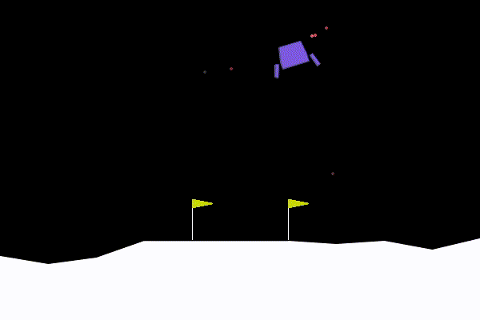

<small>Latest checkpoint from the strongest DQN configuration in the study.</small>

## Overview

This project compares three reinforcement learning approaches on `LunarLander-v2`:

- REINFORCE
- Actor-Critic
- Deep Q-Network (DQN)

I also tested a hybrid idea: Actor-Critic-guided DQN, where a pretrained Actor-Critic policy biases DQN action selection early in training and that guidance is annealed away over time.

The point of the project was not just to get one lucky run. The notebook and main training script were built around:

- seed sweeps
- checkpointed / resumable training
- quantitative comparison across configurations
  
---

## Why Lunar Lander?

`LunarLander-v2` is a good testbed because the policy has to solve several control problems at once:

- reduce vertical speed
- correct horizontal drift
- maintain a reasonable angle
- avoid hard crashes
- and complete a controlled landing rather than merely surviving longer

That makes it useful for comparing stability, variance, exploration strategy, and failure modes across RL methods. It also makes for a nice environment to visualize.

---

## Methods

### REINFORCE
REINFORCE was used as the Monte Carlo policy-gradient baseline. It is conceptually simple, but it tends to have high variance because updates depend on full-episode returns.

### Actor-Critic
Actor-Critic was used to reduce some of REINFORCE's variance by learning both:
- a policy (actor), and
- a state-value estimate (critic)

In practice, it occasionally produced strong behavior, but it was much more sensitive to seed and training dynamics. It still ended up having a lot of variance. Future work could include trying one of the more stable Actor-Critic variants, like PPO, to reduce this variance.

### DQN
DQN was the strongest value-based method in this project. It used:
- replay memory
- a target network
- epsilon-greedy exploration

This made it much more reliable than the policy-gradient baselines in these experiments.

### Actor-Critic-guided DQN
The hybrid experiment used the best Actor-Critic checkpoint as an auxiliary guide during early DQN training. The idea was not to replace DQN with Actor-Critic, but to bias early exploration toward better actions and then anneal that guidance away.

### Gradient Clipping
All model gradients were clipped to 0.5 to help prevent policy collapse, which I saw a lot in older runs.

---

## Experimental Setup

### Shared settings
- Environment: `LunarLander-v2`
- Network size: `64`
- Network depth: `2`
- Seeds per configuration: `3`

### REINFORCE sweep
- Learning rate: `1e-3`
- Discount factors: `0.95`, `0.99`
- Episodes: `1500`

### Actor-Critic sweep
- Learning rates: `1e-4`, `3e-4`
- Discount factor: `0.99`
- Critic weights: `0.3`, `0.5`
- Entropy schedules:
  - `0.001 -> 0.0001` over `800` episodes
  - `0.002 -> 0.0001` over `800` episodes
- Episodes: `3500`

### DQN sweep
- Learning rates: `1e-3`, `3e-4`
- Discount factor: `0.99`
- Replay buffer size: `50000`
- Batch size: `64`
- Target update frequency: `250`
- Epsilon schedule: `1.0 -> 0.05` over `300` episodes
- Warmup steps: `1000`
- Train frequency: `1`
- Episodes: `1200`

### Guided DQN schedules
- no guidance: `0.0 -> 0.0`
- moderate guidance: `0.5 -> 0.0` over `150` episodes
- stronger guidance: `0.8 -> 0.0` over `200` episodes

---

## Implementation Notes

The core training logic lives in `LunarLander.py`, while the sweep analysis and plotting live in `LunarLander.ipynb`.

The implementation was designed around practical experimentation on limited hardware. Important features include:

- deterministic global seeding
- per-episode seed generation
- RNG state capture and restore
- latest / best checkpoint saving
- resumable training for REINFORCE, Actor-Critic, and DQN
- seed sweep utilities for all three methods
- summary export for reward curves and losses
- CLI-based checkpoint evaluation
- replay buffer checkpointing for DQN
- optional Actor-Critic guidance during DQN training

That checkpointing machinery mattered in this project because long RL runs can get interrupted, and resumed runs are much more useful when they preserve not only model weights, but also optimizer state and random number generator state. That was especially important on limited hardware, where training could easily take days.

---

## Quantitative Summary

The notebook compared configurations using:

- **`best_100avg`**: best 100-episode rolling average reward
- **`mean_last_100`**: average reward over the final 100 episodes
- **`mean_all`**: average over the full run
- **cross-seed standard deviation**

The main ranking metric was **`best_100avg`**, but I also kept `mean_last_100` visible because some runs had strong peaks and then weakened later.

### Best configuration by method

| Method | Best config | Key settings | Mean `best_100avg` | Std `best_100avg` | Mean `last_100` | Mean `all` |
|:--|:--|:--|--:|--:|--:|--:|
| REINFORCE | cfg 1 | `lr=1e-3`, `gamma=0.99` | 105.61 | 11.69 | 97.25 | -19.48 |
| Actor-Critic | cfg 4 | `lr=3e-4`, `gamma=0.99`, `critic_weight=0.3`, entropy `0.001 -> 0.0001` over 800 eps | 91.71 | 78.55 | -31.77 | -82.71 |
| DQN | cfg 4 | `lr=3e-4`, `gamma=0.99`, `buffer=50000`, `batch=64`, epsilon `1.0 -> 0.05` over 300 eps, AC guidance `0.5 -> 0.0` over 150 eps | 247.51 | 10.38 | 97.38 | 107.35 |

### Main quantitative takeaway

Using the notebook's ranking metric (`best_100avg`):

- DQN was the strongest overall method by a large margin.
- REINFORCE was a workable baseline but far behind DQN.
- Actor-Critic could produce good seeds, but it was the most unstable method by far.

At the same time, the DQN results also showed that the configuration with the highest peak was not necessarily the one with the best final-100 behavior, which becomes important when interpreting saved checkpoints.

---

## REINFORCE Results

REINFORCE only had two configurations in the sweep, so the comparison is straightforward.

### REINFORCE config summary

| Config | Learning rate | Discount factor | Mean `best_100avg` | Std `best_100avg` | Mean `last_100` | Mean `all` | Runs |
|:--|:--|:--|--:|--:|--:|--:|--:|
| cfg 1 | `1e-3` | `0.99` | 105.61 | 11.69 | 97.25 | -19.48 | 3 |
| cfg 0 | `1e-3` | `0.95` | 14.05 | 12.13 | -66.79 | -74.66 | 3 |

The higher discount factor clearly worked better here. `gamma=0.99` was the only REINFORCE setting that produced reasonably strong late-training behavior.

### Best REINFORCE config by seed

| Seed | `best_100avg` | `mean_last_100` | `mean_all` |
|--:|--:|--:|--:|
| 0 | 99.62 | 96.13 | -9.54 |
| 1 | 98.13 | 82.09 | -24.73 |
| 2 | 119.08 | 113.53 | -24.16 |

Even the best REINFORCE runs were still slower and less efficient than the best DQN runs, but this baseline did learn partial landing behavior and provides a useful comparison point.

### REINFORCE plots

#### Config ranking
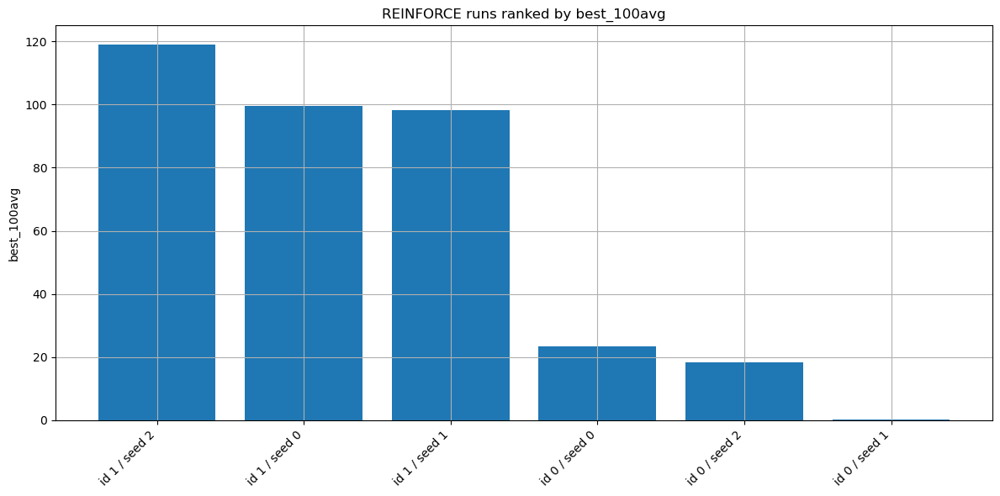

#### Best config by seed
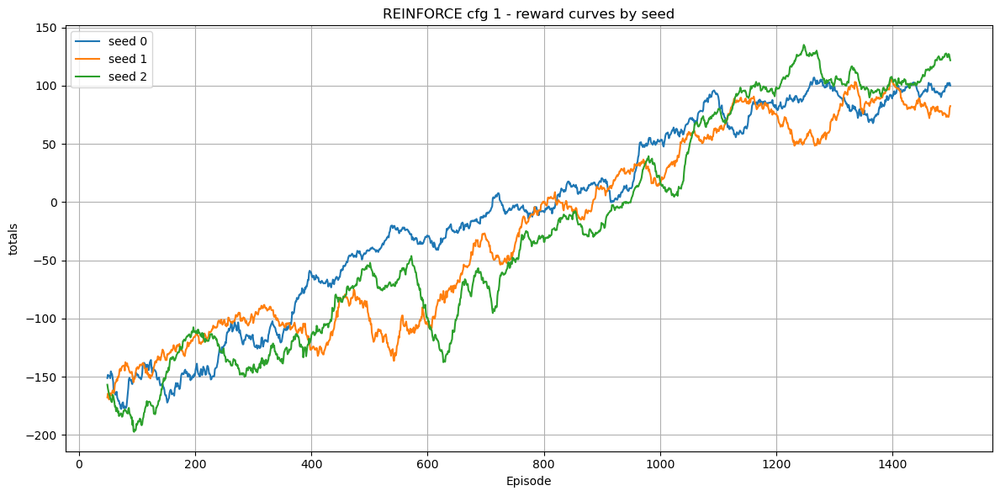

#### Best config mean ± std
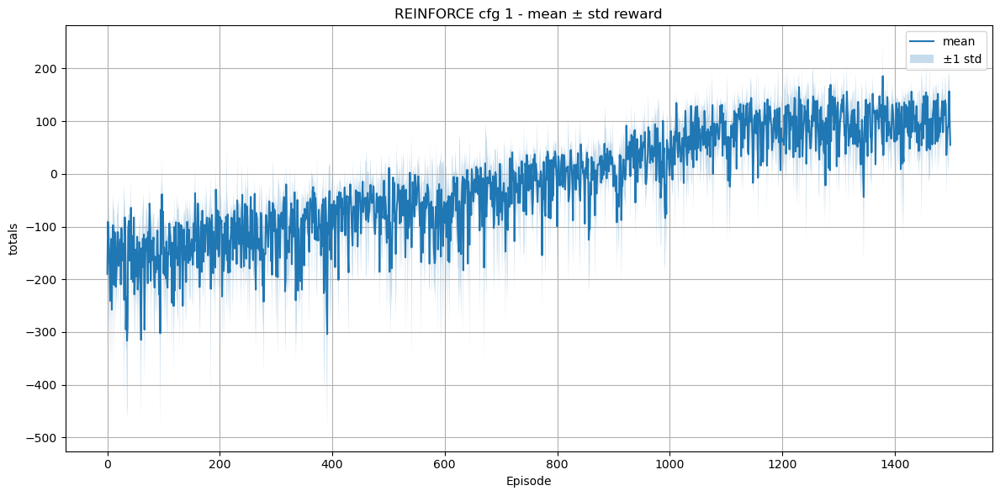

---

## Actor-Critic Results

Actor-Critic was the most unstable method in the study. It could produce strong seeds, but it also had major collapse / variance problems.

### Top Actor-Critic configurations

| Config | Learning rate | Critic weight | Entropy start | Entropy end | Anneal eps | Mean `best_100avg` | Std `best_100avg` | Mean `last_100` | Runs |
|:--|:--|--:|--:|--:|--:|--:|--:|--:|--:|
| cfg 4 | `3e-4` | 0.3 | 0.001 | 0.0001 | 800 | 91.71 | 78.55 | -31.77 | 3 |
| cfg 6 | `3e-4` | 0.5 | 0.001 | 0.0001 | 800 | 78.14 | 90.40 | -72.83 | 3 |
| cfg 7 | `3e-4` | 0.5 | 0.002 | 0.0001 | 800 | 76.42 | 6.48 | -154.33 | 3 |
| cfg 5 | `3e-4` | 0.3 | 0.002 | 0.0001 | 800 | 21.49 | 153.56 | -291.76 | 3 |

The best config was `cfg 4`, but even that result needs to be interpreted carefully because the seed-to-seed variation was severe.

### Best Actor-Critic config by seed

| Seed | `best_100avg` | `mean_last_100` | `mean_all` |
|--:|--:|--:|--:|
| 0 | 2.04 | -73.95 | -159.72 |
| 1 | 148.35 | 88.46 | -63.15 |
| 2 | 124.74 | -109.83 | -25.27 |

This table tells the real story. One seed performed well, one was decent by peak metric but collapsed late, and one effectively failed. That is why the Actor-Critic section of the project emphasizes instability rather than just reporting its best single run.

### Actor-Critic plots

#### Config ranking
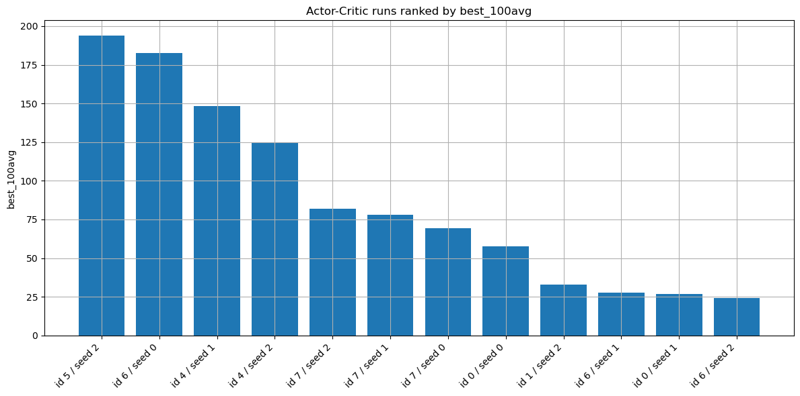

#### Best config by seed
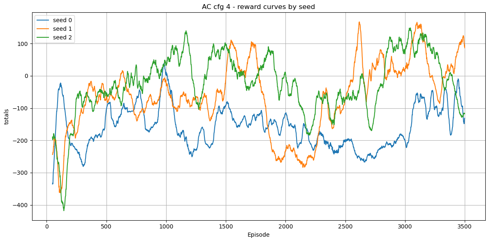

#### Best config mean ± std
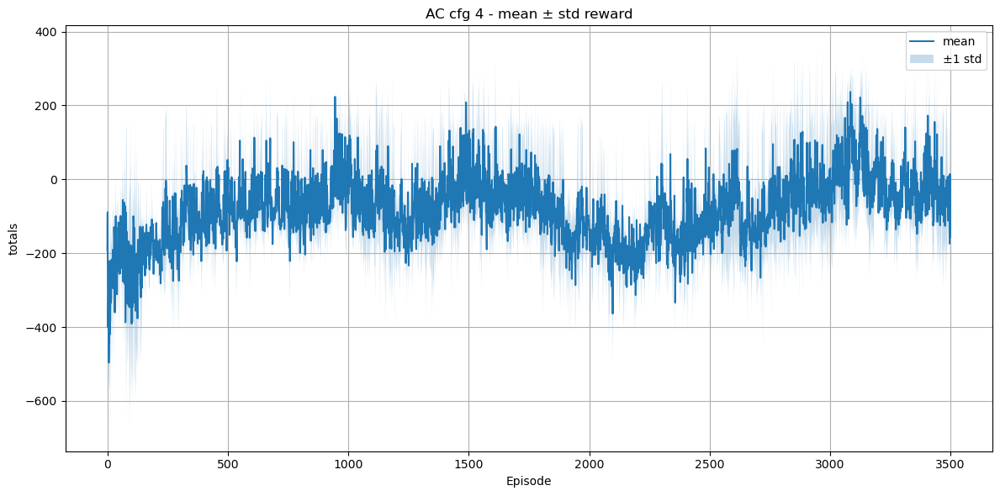

---

## DQN Results

DQN was the strongest overall method, but the notebook also showed an important nuance: which DQN config looks best depends on which metric you care about.

### DQN guidance comparison

| Config | AC guidance start | AC guidance end | Anneal eps | Mean `best_100avg` | Std `best_100avg` | Mean `last_100` | Runs |
|:--|--:|--:|--:|--:|--:|--:|--:|
| cfg 4 | 0.5 | 0.0 | 150 | 247.51 | 10.38 | 97.38 | 3 |
| cfg 5 | 0.8 | 0.0 | 200 | 236.89 | 46.74 | 176.27 | 3 |
| cfg 3 | 0.0 | 0.0 | 1 | 232.42 | 27.40 | 159.79 | 3 |
| cfg 2 | 0.8 | 0.0 | 200 | 231.83 | 6.24 | 141.97 | 3 |
| cfg 0 | 0.0 | 0.0 | 1 | 224.79 | 17.15 | 164.56 | 3 |
| cfg 1 | 0.5 | 0.0 | 150 | 220.09 | 12.30 | 128.89 | 3 |

### Interpretation

By the project's main ranking metric, moderate guidance (`0.5 -> 0.0` over 150 episodes, cfg 4) was the best DQN setting.

But it was not the best setting on every metric:

- cfg 4 had the highest mean `best_100avg`
- cfg 5 had a much stronger mean `last_100`
- cfg 3 (unguided, `lr=3e-4`) also had a stronger `last_100` than cfg 4

That is one of the central lessons of the project: a checkpoint that looks best under one training metric may not be the one that looks best under another evaluation lens.

### Best DQN config by seed

| Seed | `best_100avg` | `mean_last_100` | `mean_all` | Final loss | Mean loss last 50 |
|--:|--:|--:|--:|--:|--:|
| 0 | 252.78 | 90.76 | 95.52 | 1.01 | 1.10 |
| 1 | 235.55 | 59.89 | 108.73 | 1.28 | 1.23 |
| 2 | 254.21 | 141.48 | 117.80 | 1.04 | 1.07 |

These DQN seed results had much less variance than Actor-Critic, which is one of the main reasons DQN was the strongest method overall in this notebook.

### DQN plots

#### Config ranking
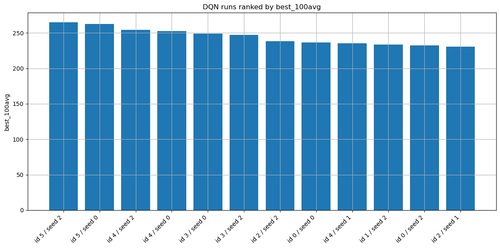

#### Best config by seed
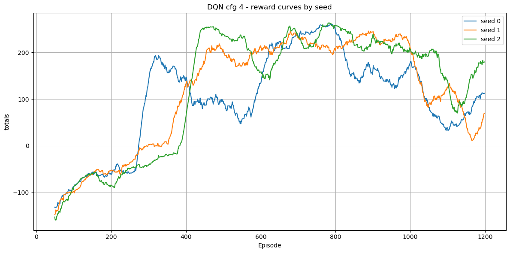

#### Best config mean ± std
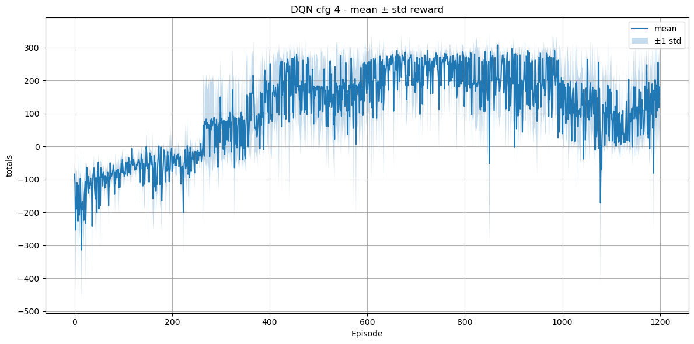

#### Best config loss mean ± std
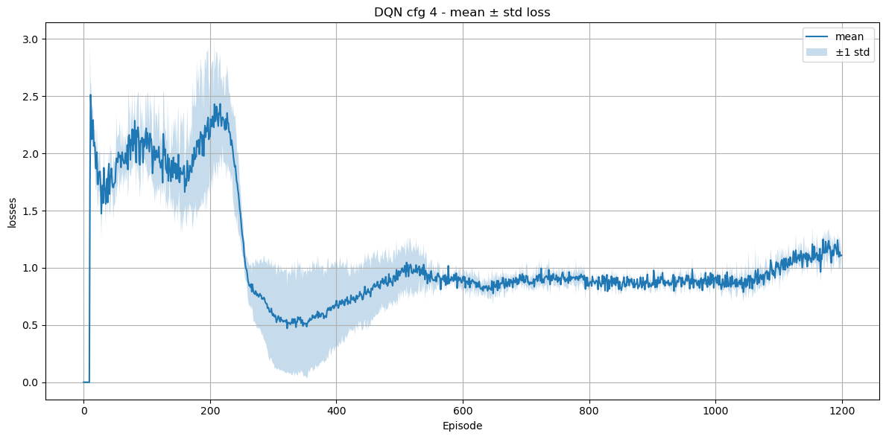

---

## Qualitative Behavior Analysis

Reward curves alone do not show the whole picture, so I also evaluated saved checkpoints visually.

This helped separate:
- strong landing behavior,
- unstable or collapsing policies,
- and policies that learned to avoid the worst crashes without really solving the task.

### Best DQN config: latest checkpoint


This rollout is the cleanest example of why DQN won the study. The lander shows stronger descent control, better angle correction, and more reliable touchdown behavior than the policy-gradient baselines.

### Best DQN config: checkpoint marked as best during training
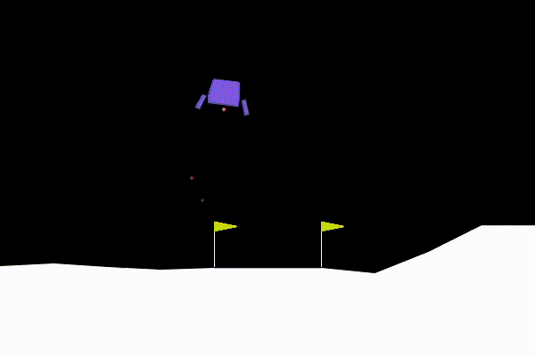

This GIF is useful because it illustrates the difference between:
- the checkpoint saved as best during training, and
- the latest checkpoint from the same run

Even though this checkpoint was marked as the best during training, it performs a little worse than the latest checkpoint from the same config. The lander descends more slowly and ends up wasting more fuel.

My best guess is that this comes from the difference between training-time and evaluation-time behavior. For DQN, epsilon-greedy exploration affects which checkpoint looks strongest during training. For Actor-Critic, entropy regularization changes how the policy behaves while it is still being optimized. And for guided DQN, the extra AC guidance early in training can help shape which part of training produces the highest rolling average, even if a later checkpoint ends up looking better under deterministic rollout.

### Strong Actor-Critic rollout


A good Actor-Critic seed can produce respectable behavior. The problem was not that Actor-Critic never worked; the problem was that it did not work consistently across seeds and checkpoints. Even this checkpoint could still crash occasionally.

### Actor-Critic floating / collapse behavior
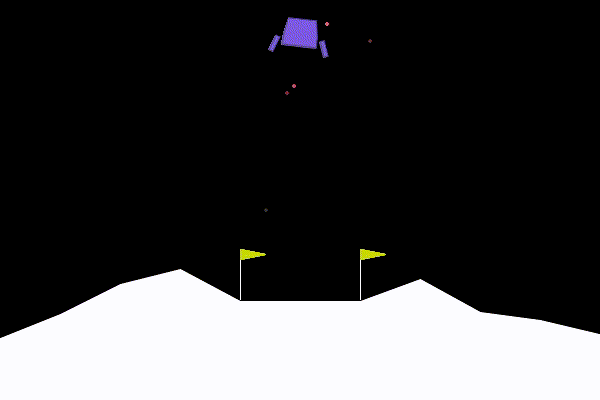

This is one of the most important failure cases in the project. Rather than learning a full landing policy, the agent can drift toward a weaker behavior that avoids catastrophic crashes by hovering or stalling descent. That can look safer than crashing, but it does not actually solve the task.

### Best REINFORCE latest checkpoint
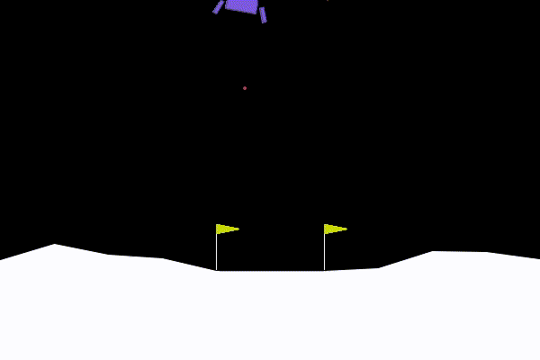

REINFORCE eventually learned partial control behavior, but it was usually slower, less efficient, and less stable than DQN and the stronger Actor-Critic runs. In rollout, it often looks more hesitant and more wasteful with control corrections.

---

## Failure Modes

Several qualitative failure modes appeared repeatedly across the experiments:

### 1. Hard crash
Some weak policies never learned stable descent or suffered from policy collapse later on, which led to the landers simply crashing into the ground. This was especially prominent with Actor-Critic.

### 2. Oscillatory correction
Some policies repeatedly over-corrected, creating unstable horizontal drift or angle oscillation. This was more evident with DQNs before convergence, Actor-Critic, and REINFORCE.

### 3. Hovering / floating instead of landing
A recurring failure mode was a policy that learned to reduce severe crash penalties by hovering or slowing descent without actually completing a landing. This was common in Actor-Critic and REINFORCE.

### 4. Strong peak, weak late behavior
Some checkpoints reached high training-window averages and then weakened later. This was especially important for interpreting the difference between latest and best checkpoints.

---

## Checkpointing and Reproducibility

A major part of the project was building a checkpoint system that made long RL runs easier to resume, compare, and inspect later.

### How the checkpoint system works

For each method, training saves both a **latest** checkpoint and a **best** checkpoint:

- **latest checkpoint**: updated every episode and intended for training resume
- **best checkpoint**: saved whenever the current 100-episode rolling average exceeds the previous best

That means "best" in this project specifically means:

> best according to the chosen training-time rolling-average criterion

not automatically the strongest policy under later deterministic evaluation.

### What all checkpoints save

REINFORCE, Actor-Critic, and DQN checkpoints all save:

- current episode index
- model weights (`model_state_dict`)
- optimizer state (`optimizer_state_dict`)
- reward history (`totals`)
- best rolling-average score so far (`best_avg`)
- model type
- architecture metadata (`size`, `depth`)
- run seed
- random number generator state for:
  - Python `random`
  - NumPy
  - PyTorch
  - CUDA (when available)
  - the per-episode RNG

Saving RNG state matters because resumed RL runs can diverge quickly if randomness is not restored consistently.

### What DQN additionally saves

DQN checkpoints also save:

- target network weights (`target_model_state_dict`)
- loss history (`losses`)
- global environment step count (`global_step`)
- Actor-Critic guidance schedule values
- the replay buffer

This is especially important for deterministic or near-deterministic resume. For DQN, resuming without the replay buffer would not really be continuing the same run, because future updates would be based on a different sample distribution.

### One important implementation detail

Not every hyperparameter is stored directly inside the checkpoint dictionary.

Some values are encoded in the checkpoint folder path, including settings such as:

- learning rate
- discount factor
- epsilon schedule
- buffer size / batch size
- critic weight
- entropy schedule

So the full experiment identity comes from both:
- the checkpoint contents, and
- the path name that produced the checkpoint

### Practical takeaway

The checkpoint system was not just a convenience feature. It was part of the experimental design. It made long runs restartable, improved reproducibility, and made it easy to revisit saved policies later for rollout GIFs and qualitative comparison.

---

## Why the “Best” Checkpoint Is Not Always the Best Policy

This project ended up showing an important RL lesson.

### DQN
During training, DQN uses epsilon-greedy exploration. So the checkpoint that looks strongest during a training window is not guaranteed to be the strongest pure greedy policy later.

### Actor-Critic
Actor-Critic uses stochastic sampling and entropy regularization during training. That means the checkpoint that looked strongest in training may not look strongest when evaluated greedily afterward.

### Guided DQN
Guided DQN adds one more moving part. Early in training, AC guidance biases action selection before annealing away. That can help produce a stronger peak window, but it also means the checkpoint that wins on a rolling training metric is not automatically the one that looks best once guidance is gone and evaluation is purely greedy.

### Interpretation
So when the README says a checkpoint was "best," that should be read as:

> best under the project's saved training criterion

not:

> guaranteed best deployment-time policy

That is why the GIF comparison between the DQN latest checkpoint and the DQN checkpoint marked as best is useful.

---

## Reproducing the Rollout GIFs

The GIFs in the README came from evaluating saved checkpoints with `LunarLander.py`.

<details>
<summary>Checkpoint commands used for the GIFs</summary>

```bash
# DQN: best config, latest checkpoint
python LunarLander.py --checkpoint dqn_models/dqn_df0.99_size64_depth2_lr0.000300_bs50000_batch64_tuf250_epss1.0000_epse0.0500_epsd300_acgs0.50_acge0.00_acga150_seed2/latest_dqn.pt

# DQN: same config/seed, checkpoint marked best during training
python LunarLander.py --checkpoint dqn_models/dqn_df0.99_size64_depth2_lr0.000300_bs50000_batch64_tuf250_epss1.0000_epse0.0500_epsd300_acgs0.50_acge0.00_acga150_seed2/best_dqn.pt

# Actor-Critic: best-performing seed checkpoint
python LunarLander.py --checkpoint ac_models/ac_df0.99_cw0.300_size64_depth2_lr0.000300_ews0.001000_ewe0.000100_ewa800_seed1/best_actor_critic.pt

# Actor-Critic: later checkpoint from the same run showing weaker "floating" behavior
python LunarLander.py --checkpoint ac_models/ac_df0.99_cw0.300_size64_depth2_lr0.000300_ews0.001000_ewe0.000100_ewa800_seed1/latest_actor_critic.pt

# REINFORCE: best latest checkpoint
python LunarLander.py --checkpoint reinforce_models/reinforce_df0.99_size64_depth2_lr0.001000_seed2/latest_reinforce.pt
```

</details>

---

## Running the Code

### Evaluate a saved checkpoint
```bash
python LunarLander.py --checkpoint path/to/checkpoint.pt --episodes 5 --seed 42
```

### Run without a checkpoint
```bash
python LunarLander.py --episodes 5
```

The script also includes seed-sweep helpers for:
- `run_reinforce_seed_sweep(...)`
- `run_ac_seed_sweep(...)`
- `run_dqn_seed_sweep(...)`

---

## Repository Contents

```text
LunarLander.py                 # main training / evaluation script
LunarLander.ipynb              # notebook for sweeps, summaries, and plotting
docs/GIFs/                     # rollout GIFs used in the README
docs/plots/reinforce/          # REINFORCE figures
docs/plots/actor_critic/       # Actor-Critic figures
docs/plots/dqn/                # DQN figures
seed_sweeps/                   # saved sweep outputs and summaries
```

---

## Final Takeaway

The main result is straightforward:

- DQN was the strongest and most reliable method overall.
- REINFORCE learned useful partial behavior but remained clearly weaker.
- Actor-Critic could look promising on some seeds, but it was too unstable to trust at the same level as DQN.

The more interesting result is the subtle one:

- moderate AC guidance gave the best DQN peak metric,
- but other DQN settings looked better on some late-training metrics,
- and the difference between best and latest checkpoints mattered enough to be visible in rollout.

That is what made this project more than just a scoreboard. It became a small study in RL stability, checkpoint interpretation, and the gap between reward curves and real policy behavior.


## Acknowledgements

The book Hands-On Machine Learning with Scikit-Learn and PyTorch by Aurélien Géron was very helpful with this project.